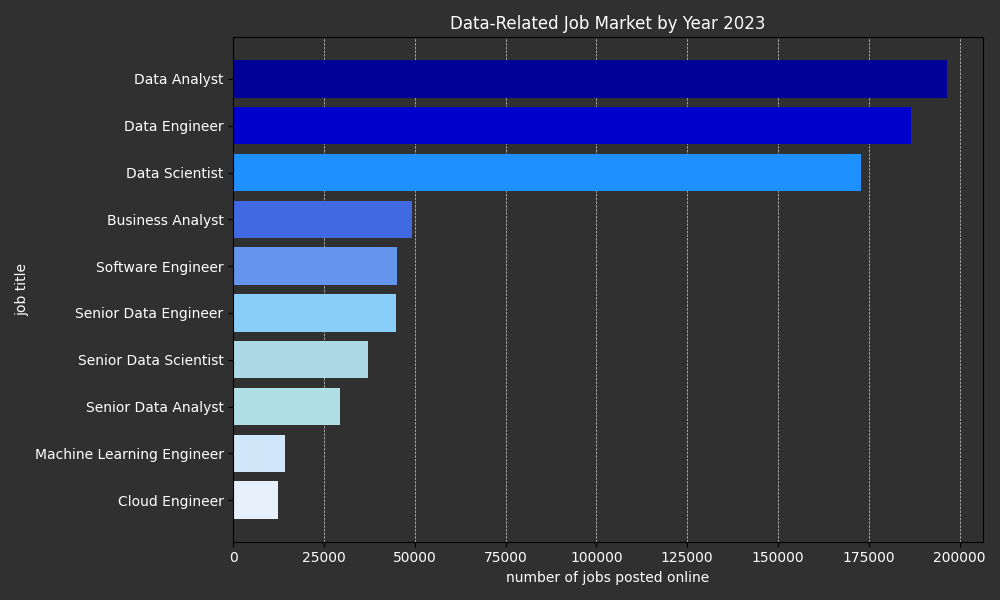
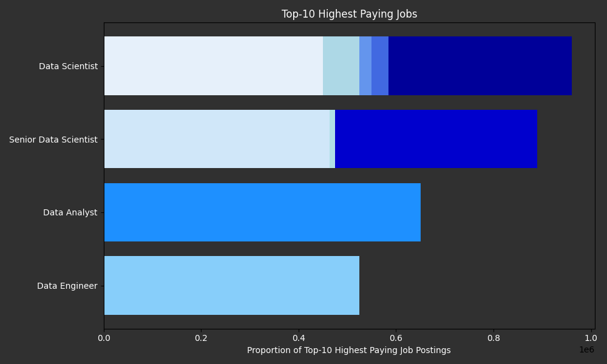
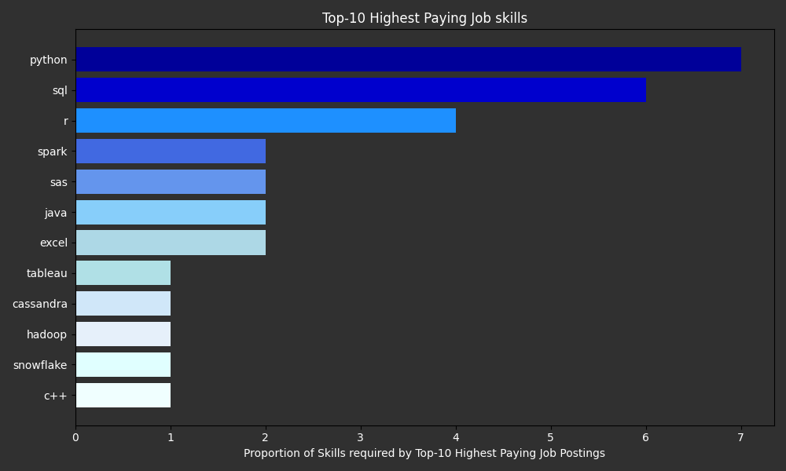
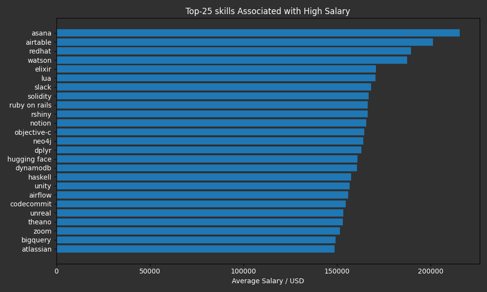
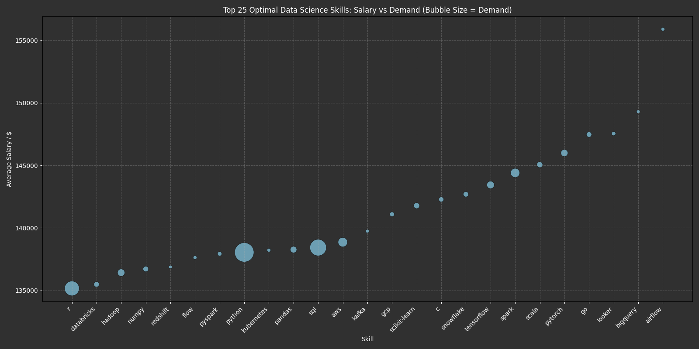

# Introduction
Curious about the data science job market, I set out to explore real-world job postings to uncover insights about demand, salaries, and required skills. This project addresses key questions such as:

- How strong is the demand for Data Scientist roles?

- What is the average salary for a Data Scientist?

- Which skills lead to higher salaries?

- What are the most in-demand tools and technologies in the field?

Through this project, I aim to provide a comprehensive snapshot of the job landscape for Data Scientists, offering actionable insights for anyone looking to break into or grow within this field.

This project is based on an excellent YouTube course by [Luke Barousse](https://www.linkedin.com/in/luke-b/) and [Kelly Adams](https://www.linkedin.com/in/kellyjianadams/), who provided not only the data but also a well-structured learning experience for aspiring data professionals. I am grateful for their efforts in making technical learning accessible and practical.

# 🧠 2. Background
As a physicist, I’ve always been drawn to the world of data science and sought to build a strong foundation in its core tools. After researching what skills are essential, I discovered that SQL is one of the most in-demand competencies for data professionals.

To begin my journey, I enrolled in a YouTube course by [Luke Barousse](https://www.youtube.com/@LukeBarousse), which provided hands-on experience analyzing job postings from 10 different roles in the data domain — including Data Scientist, Data Analyst, Data Engineer, Cloud Engineer, and more.

Throughout this project, I focused primarily on Data Scientist roles, gradually narrowing my questions to uncover the most optimal skills — those that are both highly in-demand and correlated with higher salaries.


# 🛠️ 3. Tools I Used
Here are the tools and technologies I used to complete this project:

**SQL**: The primary language for querying and exploring the dataset.

**PostgreSQL**: A powerful relational database used to manage and process the job postings data.

**Visual Studio Code**: My preferred editor for writing and running SQL queries.

**Jupyter Notebook**: Used for visualizing query results and creating data plots using Python.

**Git & GitHub**: Essential for version control and sharing my project with others.

**ChatGPT**: Assisted me in optimizing my visualizations, improving explanations, and polishing the overall structure of the project documentation.

# Job Market Analysis: Insights into Roles, Salaries, and In-Demand Skills
In this analysis, I explored a dataset of job postings to uncover meaningful insights about roles, salaries, and required skills. The investigation is structured around key questions that each address a specific aspect of the data.

### 1. Distribution of Job Postings by Role
To begin, I examined the number of job postings associated with each job title. This provides an overview of the most common roles in the dataset.

```sql
SELECT
    job_title_short,
    ROUND(AVG(salary_year_avg), 0) AS salary_avg,
    COUNT(salary_year_avg) AS num_slaries
FROM
    job_postings_fact
WHERE
    salary_year_avg IS NOT NULL
GROUP BY
    job_title_short    
ORDER BY
    salary_avg DESC,
    num_slaries DESC;
```

*Figure 1: Data-Related Job Market by Year 2023
This horizontal bar chart shows the distribution of job postings for various data-related roles in 2023. "Data Analyst", "Data Engineer", and "Data Scientist" lead the market, each with over 170,000 postings, highlighting their high demand.*

From there, I took a deeper look by analyzing the average salary per role.

### 💼 Average Salary by Job Title

| Job Title                  | Average Salary (USD) | Number of Salaries |
|---------------------------|----------------------|---------------------|
| Senior Data Scientist     | 154,050              | 1,686               |
| Senior Data Engineer      | 145,867              | 1,594               |
| Data Scientist            | 135,929              | 5,926               |
| Data Engineer             | 130,267              | 4,509               |
| Machine Learning Engineer | 126,786              | 573                 |

Click [here](project_luke/2_query.sql) to see its relevant SQL query.

Additionally, I identified the top 10 highest-paying jobs and it was not a surprise for me to see Data Scientist and Senior Data Scientist roles dominate the top-paying positions — they take up the majority of the bar range across multiple stacked components.

*Figure 2: Top-10 Highest Paying Jobs
This chart visualizes the top-paying data-related roles based on job postings, with "Data Scientist" and "Senior Data Scientist" appearing as the most lucrative positions. The colors represent pay gradients, with darker shades indicating higher pay brackets.*

### 2. Focus on Data Scientist Positions
Given my interest in the field of data science, I focused specifically on job postings for Data Scientist roles. In the previous section, we observed that this title ranks among the top three most frequently posted jobs, with one of the highest average salaries.

In this section, I extracted the top 10 highest-paying Data Scientist positions and investigated which skills were most frequently listed for those roles. Here is my SQL query:

```sql
WITH top_skills AS(

    WITH top_paying_jobs AS(
        SELECT
            job_id,
            job_title,
            salary_year_avg,
            company_dim.name
        FROM
            job_postings_fact
        INNER JOIN company_dim ON company_dim.company_id = job_postings_fact.company_id
        WHERE
            salary_year_avg IS NOT NULL
            AND
            job_title_short='Data Scientist'
        ORDER BY
            salary_year_avg DESC
        LIMIT 10
    )

    SELECT 
        top_paying_jobs.*,
        skills_dim.skills
    FROM
        top_paying_jobs
    INNER JOIN skills_job_dim ON skills_job_dim.job_id = top_paying_jobs.job_id
    INNER JOIN skills_dim on skills_dim.skill_id = skills_job_dim.skill_id
)

SELECT
    top_skills.skills,
    COUNT(top_skills.skills) AS num_skill
FROM
    top_skills
GROUP BY
    top_skills.skills
ORDER BY
    num_skill DESC
;
```
*Figure 3: Top-10 Highest Paying Job Skills
This figure illustrates the most in-demand technical skills among top-paying jobs. Programming languages like Python, SQL, and R dominate, reaffirming their core value in data careers.*

The figure indicates that *python, sql,* and *r* are highly demanded skills needed to get hired the top 10 highest-paying Data Scientist positions.

### 3. Most In-Demand Skills for Data Scientists

Having looked at the top 10 high-paying Data Scientist roles, I expanded the scope to understand which skills are most in-demand across all Data Scientist job postings.

### 🧠 Skill Demand Counts

| Skill   | Demand Count |
|---------|--------------|
| Python  | 114,016      |
| SQL     | 79,174       |
| R       | 59,754       |
| SAS     | 29,642       |
| Tableau | 29,513       |

Furthermore, I compared the required skills for on-site versus remote roles to determine whether job type influences skill demand.

### 🌍 Skill Demand in Remote Roles

| Skill   | Demand Count (Remote Roles Only) |
|---------|----------------------------------|
| Python  | 10,390                           |
| SQL     | 7,488                            |
| R       | 4,674                            |
| AWS     | 2,593                            |
| Tableau | 2,458                            |

The table above, which focuses exclusively on remote Data Scientist roles, reveals many similarities with the overall Data Scientist job data. In both cases, the top three in-demand skills are Python, SQL, and R, and Tableau consistently appears in fifth place. However, a key difference lies in the fourth position: across all Data Scientist roles, SAS holds this spot, whereas in remote-only positions, it is replaced by AWS.

### 4. Salary-Boosting Skills for Data Scientists
If the primary goal is to maximize income as a Data Scientist, it becomes important to ask:
What skills are associated with higher-paying roles?

In this section, I identified the skills that are most commonly present in high-paying Data Scientist jobs, regardless of demand or frequency. Below, you can see the sql code and also a bar plot associated with the result.

```sql
WITH top_skills AS(

WITH top_paying_jobs AS(
    SELECT
        job_id,
        job_title,
        salary_year_avg,
        company_dim.name
    FROM
        job_postings_fact
    INNER JOIN company_dim ON company_dim.company_id = job_postings_fact.company_id
    WHERE
        salary_year_avg IS NOT NULL
        AND
        job_title_short='Data Scientist'
    ORDER BY
        salary_year_avg DESC
    )

SELECT 
    top_paying_jobs.*,
    skills_dim.skills
FROM
    top_paying_jobs
INNER JOIN skills_job_dim ON skills_job_dim.job_id = top_paying_jobs.job_id
INNER JOIN skills_dim on skills_dim.skill_id = skills_job_dim.skill_id
)


SELECT
    top_skills.skills,
    ROUND(AVG(salary_year_avg), 0) AS sal_avg
FROM
    top_skills
GROUP BY
    skills
ORDER BY
    sal_avg DESC
LIMIT
    25
;
```
*Figure 4: Top-25 Skills Associated with High Salary
This graph presents the skills most associated with higher salaries. Tools like Asana, Airtable, and RedHat are at the top, suggesting a niche but valuable demand for expertise in certain platforms and frameworks.*

Interestingly, none of the top 25 high-paying skills overlap with the most top 5 in-demand skills across the entire dataset.

### 5. Optimal Skills: Balancing High Pay and Demand

Finally, I compared the results of sections 3 and 4. While some skills are frequently in demand, others are more strongly correlated with higher salaries. This raises a valuable question:

What are the optimal skills to develop—those that are both high-paying and in high demand?

To answer this, I analyzed the intersection of the two skill sets and visualized the findings to highlight the most strategic skills for career growth in data science when specified skill frequency was higher than 100 times throughout the dataset.

```sql
SELECT
    skills_dim.skill_id,
    skills_dim.skills,
    COUNT(skills_job_dim.job_id) AS demand_count,
    ROUND(AVG(job_postings_fact.salary_year_avg), 0) AS avg_salary
FROM
    job_postings_fact
INNER JOIN skills_job_dim ON skills_job_dim.job_id = job_postings_fact.job_id
INNER JOIN skills_dim ON skills_dim.skill_id = skills_job_dim.skill_id
WHERE
    job_title_short='Data Scientist'
    AND
    salary_year_avg IS NOT NULL
GROUP BY
    skills_dim.skill_id
HAVING
    COUNT(skills_job_dim.job_id) > 100
ORDER BY
    avg_salary DESC,
    demand_count DESC
LIMIT
    25
;
```
*Figure 5: Top 25 Optimal Data Science Skills – Salary vs Demand (Bubble Size = Demand)
This bubble chart compares average salaries to demand across 25 top data science skills. Skills like Airflow, BigQuery, and Looker offer high salaries, while tools such as Python and SQL show massive demand (indicated by larger bubbles) despite relatively moderate salaries.*


# ✨ 5. What I Learned
One of the early challenges I faced was understanding foreign keys and the rationale behind storing information in multiple related tables rather than a single flat structure. Fortunately, the course provided a clear and structured approach that helped solidify these concepts through repeated practice.

I also learned to think in SQL — understanding how queries are processed, the execution order of statements, and how to break down problems into step-by-step logic. This mindset made writing and debugging queries much easier.

A highlight of my learning was gaining confidence in using different types of JOINs, which are crucial when working with multi-table data. I also began optimizing queries for better performance, though I recognize this is an area where I still want to grow.

One insight from the data that genuinely surprised me was the high demand for remote roles. It reinforced the idea that location doesn’t need to limit opportunity — especially in tech and data science.

Lastly, I learned how to move from broad questions to detailed analysis, using clear visuals to tell a data-driven story that’s easy for others to follow.


# ✅ 6. Conclusion
The biggest takeaway from this project is that I don’t need to limit myself to physics alone. Building this portfolio project and sharing it on GitHub is a step toward positioning myself as a strong candidate for Data Analyst and Data Scientist roles.

Learning SQL has strengthened my technical foundation significantly. Having already used Python extensively in my Master’s program — for data analysis, simulations, and automating workflows — I now plan to expand my skillset by learning Tableau and other tools that enhance data storytelling.

I hope this project inspires others to dive into SQL and explore how data can be used to answer meaningful, real-world questions.

